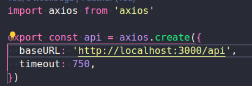
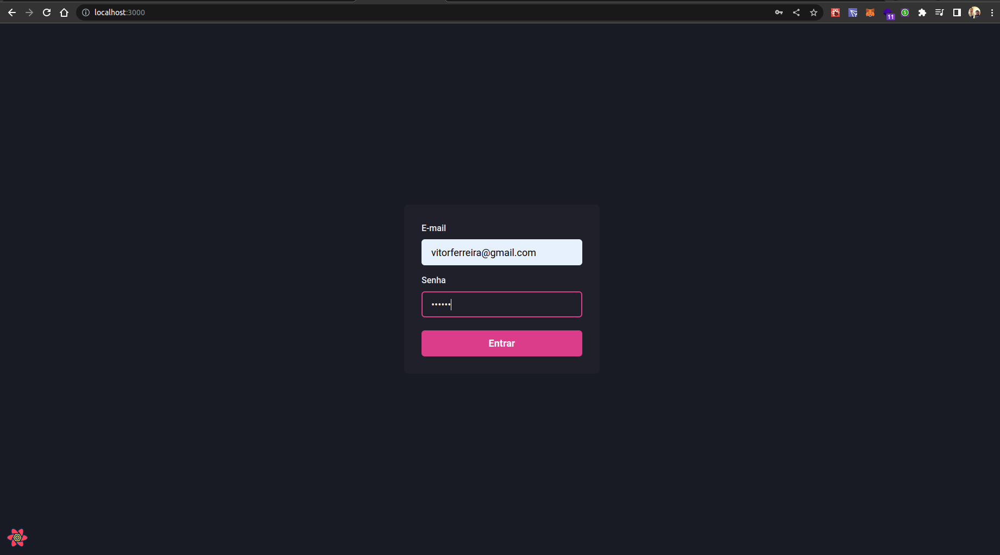
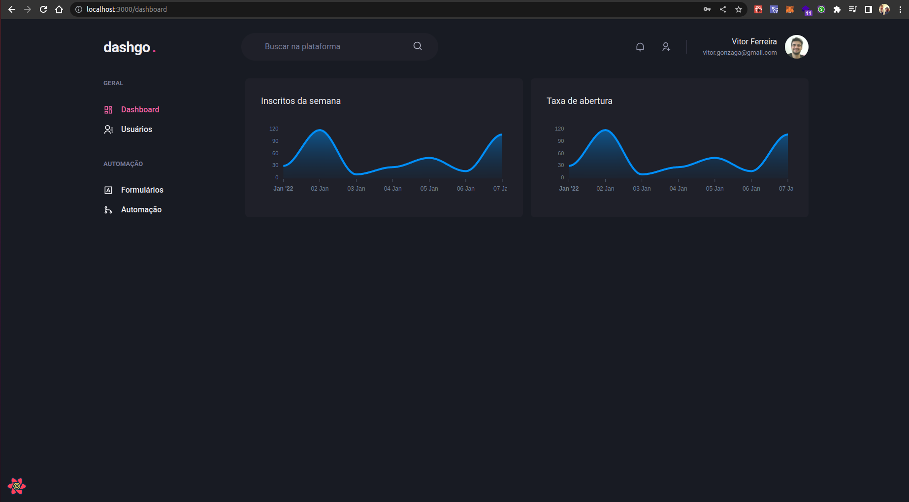
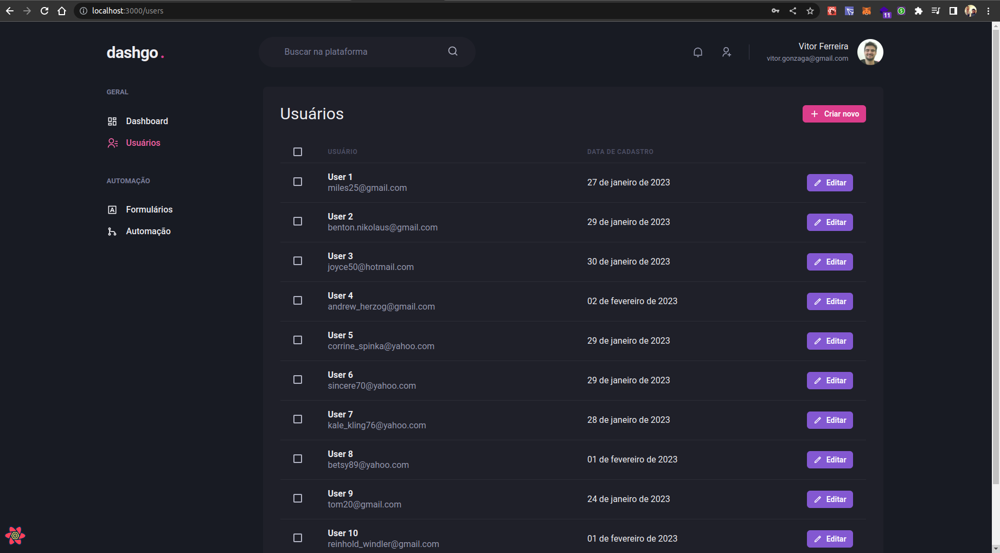
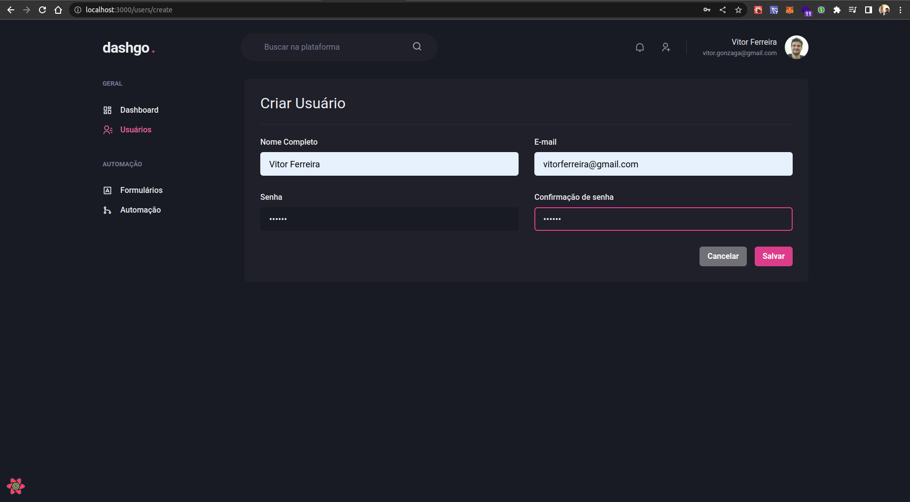

# Chapter 4 from Ignite Course at RocketSeat

Developing the Dashgo project with chakra ui. This repository is created to follow lessons of chapter 4 at RocketSeat Ignite course.

# Resources

- Next.js
- React.js
- Chakra-ui
- React-Query
- Typescript

## Deployment

https://dashgo-gray.vercel.app/

Remembering that user list is going created by a server with mirage.js in a environment development. It isn't works in a production environment.

Obs.: The Forms and Automation links (Formulários e automação) doesnt have components to display, there is only routes. This app was made following steps in a "Rocketseat" course.

# Screenshots

## SignIn Page

## Dashboard Page

## User List Page

## Create User Page

## 🔗 Links

